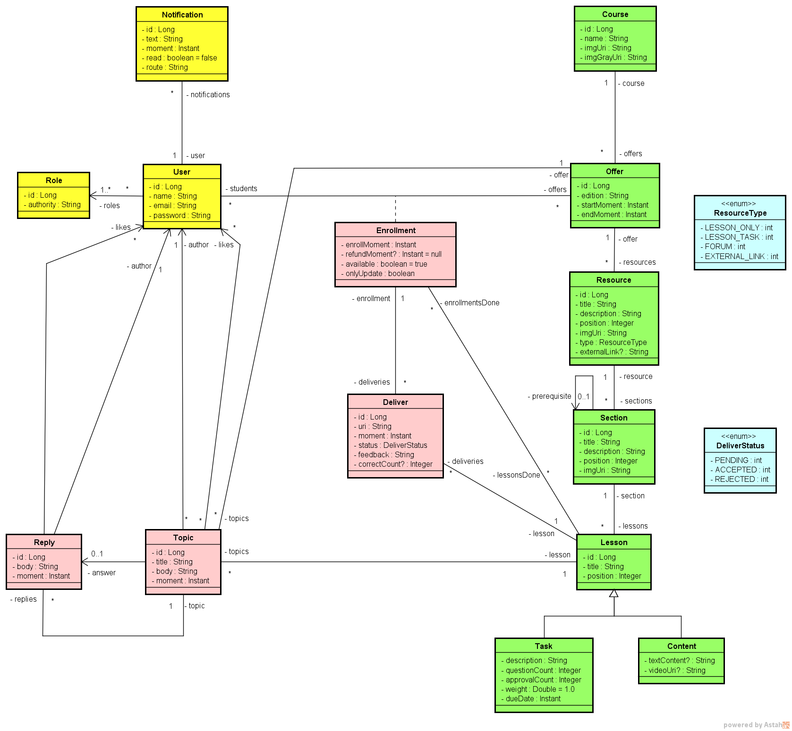

# Teaching Platform 

  

Esse projeto nasceu com um objetivo bem claro: exercitar modelagem de domínio em um cenário que realmente exige organização, regra de negócio e clareza estrutural.

A proposta foi representar uma plataforma de ensino completa, com cursos, turmas, alunos, professores, tarefas, entregas, notificações e um fórum integrado. Mais do que fazer algo funcionar, a intenção foi estruturar um domínio consistente, com entidades que fazem sentido no mundo real e relacionamentos que sustentam o crescimento do sistema.

Um curso pode ter várias ofertas (turmas), cada uma com seu período de início e fim. O aluno não se matricula diretamente no curso, mas sim em uma oferta específica. Essa decisão impacta toda a modelagem e traz mais flexibilidade para o sistema, permitindo diferentes edições do mesmo curso com pequenas variações de conteúdo.

O conteúdo foi pensado de forma hierárquica: recursos organizam seções, que organizam aulas. As aulas podem ser apenas conteúdo (vídeo/texto) ou tarefas avaliativas. Para isso, utilizei herança no modelo (Lesson como base, especializando em Content e Task), representando comportamentos diferentes dentro de uma mesma estrutura.

As tarefas possuem peso, data de entrega e critério mínimo de aprovação. Quando um aluno envia uma atividade, nasce uma entrega com estado controlado (pendente, aceita ou rejeitada), permitindo representar o fluxo real de correção por parte do professor.

O fórum também faz parte do domínio. Cada curso pode ter seu espaço de discussão, com tópicos, respostas, sistema de upvote e marcação de melhor resposta — respeitando regras como impedir que o usuário vote no próprio conteúdo e limitar quem pode marcar a resposta correta.

Além disso, usuários recebem notificações, e papéis diferentes (aluno, professor e administrador) controlam o que cada um pode fazer dentro do sistema — por exemplo, apenas administradores podem criar cursos e turmas.

